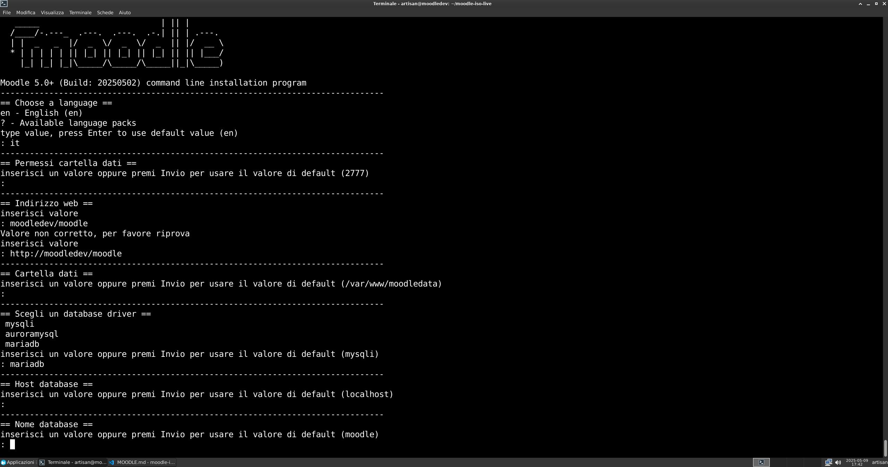

# MOODLE
Moodle è una piattaforma open source per la gestione dell'apprendimento, conosciuta anche come LMS (Learning Management System). È utilizzata da scuole, università, aziende e istituzioni per creare corsi online, gestire contenuti didattici, monitorare l'apprendimento e facilitare la comunicazione tra insegnanti e studenti.

Caratteristiche principali di Moodle:
Creazione e gestione dei corsi: consente di organizzare contenuti (testi, video, file, quiz, compiti) in modo modulare.

Valutazione: quiz, compiti, voti e feedback automatizzati o manuali.

Interazione: forum, chat, sondaggi, messaggistica interna.

Personalizzazione: supporta plugin, temi e moduli per adattarsi a varie esigenze.

Multilingua: disponibile in decine di lingue, compreso l’italiano.

Accesso controllato: gestione di ruoli e permessi (studente, docente, amministratore).

Open Source: è gratuito e personalizzabile, con una vasta comunità di sviluppatori.

Dove si usa?
Scuole e università: per corsi online o come supporto alla didattica tradizionale.

Aziende: per la formazione interna del personale (e-learning).

Formazione professionale: per corsi certificati e aggiornamento continuo.

## Installazione
    
Ho usato delle impostazioni, su `/etc/bash.bashrc`, valide quindi per ogni utente, anche live:

```
...
# Moodledev customize
export MOODLE=/var/www/html/moodle
export LOCAL=$MOODLE/local
umask 0002
export VSCODE_EXTENSIONS="/opt/vscode_extension"artisan@moodledev:~/moodledev$ 
```

Utilizziamo [Moodle](https://moodle.org/?lang=it) direttamente dal repository [git](git://git.moodle.org/moodle.git), per facilitarne l'aggiornamento ed il cambio versione.

Dopo i primi esperimenti con la versione `MOODLE_405_STABLE` sono passato a `MOODLE_500_STABLE`, ma è facile passare da una versione all'altra, vedi l'istruzione `git checkout MOODLE_500_STABLE`.

* Moodle 4.5 LTS requires Moodle 4.1 LTS or higher because it is an LTS release.
* Moodle 5.0 has a minimum PHP version of 8.2, therefore it requires Moodle 4.2.3 which was the first version to support PHP 8.2.

### Database
Collegati alla pagina di amministrazione di [pnpmyadmin](./phpmyadmin), login con `root/evolution`, cancella e ricrea il datase moodle.

### Files
Anche se per convenzione, nelle repository git il nome dei plugin è `[moodle]-[type]_[oluginname]`, nella struttura di moodle, viene ad esere `[moodle]/[type]/[loginname]`.

Ho posto in `/opt/moodle-latest-500.zip`, la versione ultima stable di moodle. Questa può essere scaricata ed aggiornata da [moodle last realease](https://download.moodle.org/releases/latest/).

Copia ed incolla:

```
$HOME/moodle-iso-live/recreate.sh
```

### Creazione di user e database moodle
Aprire la pagina di myphpadmin e connettersi con `root/evolutio`

Scegliere `User accounts` e creare il nuovo utente `moodle` con password `evolution`. Ricordare la spunta su `Create database with same name and grant all privileges`. 

Verrà creato l'utente `moodle` ed il database `moodle` sul quale l'utente avrà pieni privilegi.


### Installazione Moodle CLI
Ho avuto diversi problemi con l'installazione di moodle da browser, consiglio pertanto l'installazione CLI che è sia più veloce che più accurata. Copia ed incolla:

```
sudo chown www-data $MOODLE
cd $MOODLE/admin/cli
sudo -u www-data /usr/bin/php install.php
sudo chown -R artisan:www-data $MOODLE

```



### Moduli AMD (Asynchronous module definition)

Per utilizzare i moduli AMD occorre installare [grunt](https://gruntjs.com/) e `nodejs>=v22.15.0`.

```
cd $MOODLE
pnpm i
```

Quindi compilare i moduli amd.

```
pnpx grunt amd  --debug --root=local/confirm --force
```
