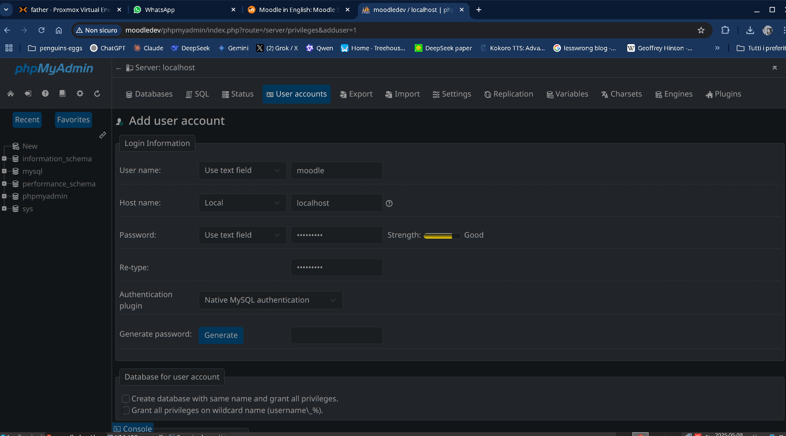

# MOODLE
Utilizziamo [Moodle](https://moodle.org/?lang=it) direttamente dal repository [git](git://git.moodle.org/moodle.git), per facilitarne l'aggiornamento ed il cambio versione.

Dopo i primi esperimenti con la versione `MOODLE_405_STABLE` sono passato a `MOODLE_500_STABLE`, ma è facile passare da una versione all'altra, vedi l'istruzione `git checkout MOODLE_500_STABLE`.

* Moodle 4.5 LTS requires Moodle 4.1 LTS or higher because it is an LTS release.
* Moodle 5.0 has a minimum PHP version of 8.2, therefore it requires Moodle 4.2.3 which was the first version to support PHP 8.2.

## Database
Collegati alla pagina di amministrazione di [pnpmyadmin](./phpmyadmin), login con `root/evolution`, cancella e ricrea il datase moodle.

## Files
Anche se per convenzione, nelle repository git il nome dei plugin è `[moodle]-[type]_[oluginname]`, nella struttura di moodle, viene ad esere `[moodle]/[type]/[loginname]`.

Ho posto in `/opt/moodle-latest-500.zip`, la versione ultima stable di moodle. Questa può essere scaricata ed aggiornata da [moodle last realease](https://download.moodle.org/releases/latest/).

Copia ed incolla:

```
$HOME/moodle-iso-live/recreate.sh
```

## Creazione di user e database moodle
Aprire la pagina di myphpadmin e connettersi con `root/evolutio`

Scegliere `User accounts` e creare il nuovo utente `moodle` con password `evolution`. Ricordare la spunta su `Create database with same name and grant all privileges`. 

Verrà creato l'utente `moodle` ed il database `moodle` sul quale l'utente avrà pieni privilegi.




## Installazione Moodle CLI
Ho avuto diversi problemi con l'installazione di moodle da browser, consiglio pertanto l'installazione CLI che è sia più veloce che più accurata. Copia ed incolla:

```
sudo chown www-data $MOODLE
cd $MOODLE/admin/cli
sudo -u www-data /usr/bin/php install.php
sudo chown -R artisan:www-data $MOODLE

```


## Moduli AMD (Asynchronous module definition)

Per utilizzare i moduli AMD occorre installare [grunt](https://gruntjs.com/) e `nodejs>=v22.15.0`.

```
cd $MOODLE
pnpm i
```

Quindi compilare i moduli amd.

```
pnpx grunt amd  --debug --root=local/confirm --force
```

