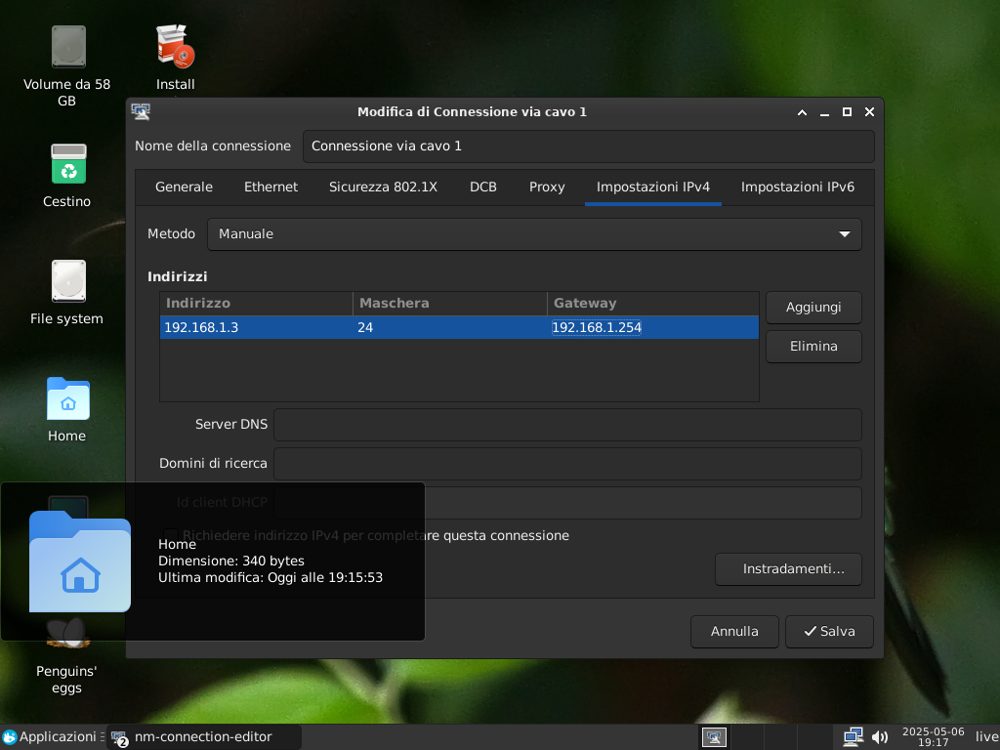

# README

`moodledev` è una live Debian bookworm, adattata per lo sviluppo con [moodle](./MOODLE.md). La puoi scaricare liberamente dal mio [drive](https://drive.google.com/drive/folders/18QIqicyecLMuU1Zmb2E039gWawzZuy3e?dmr=1&ec=wgc-drive-globalnav-goto), cerca l'ultima versione di `egg_of-debian-booworm-moodledev_amd64_...`.

Avviata la live, potrete utilizzarla così com'è, oppure installare il sistema utilizzando l'installer grafico calamares.

## User/password
* gli utenti di sistema nella live sono: `live/evolution` e `root/evolution`;
* l'utente `root` di mariadb è `root/evolution`, l'utente per moodle nel database è `moodle/evolution`, usa [phpmyadmin](http://moodledev/phpadmin) per connetterti al database:
* l'utente amministratore del sito http://moodledev/moodle è: `admin/evolution`:
* le cartelle `moodle` e `moodledata` sono rispettivamente `/var/www/html/moodle`, e `/var/www/moodledata`.

## vscode extensions
E' preinstallato Visual Studio Code con le estensioni: 
* [PHP InselliSense](https://marketplace.visualstudio.com/items?itemName=zobo.php-intellisense)
* [MDLCode - Moodle Plugin Development](https://marketplace.visualstudio.com/items?itemName=LMSCloud.mdlcode)

## [Plugin in sviluppo](https://github.com/pieroproietti?tab=repositories&q=moodle-&type=&language=&sort=)
Sto sviluppando alcuni semplici plugin per acquisire esperienza, li potete trovare [qui](https://github.com/pieroproietti?tab=repositories&q=moodle-&type=&language=&sort=).

## Link di sviluppo
* [Developer Resource centre](https://moodledev.io/)
* [Welcome to the Moodle community](https://moodle.org/)
* [Piazzale Italia](https://moodle.org/mod/forum/view.php?id=956)

# Utilizzo
Questa immagine ISO live può essere utilizzata così com'è all'interno di un virtualizzatore come [boxes](https://apps.gnome.org/en/Boxes/), [proxmox ve](https://pve.proxmox.com/wiki/Main_Page), [virtualbox](https://www.virtualbox.org/) o copiata all'interno di una USB formattata con [ventoy](https://www.ventoy.net/en/index.html).

Potete, infine, masterizzarla su una chiavetta USB con strumenti come [balena etcher](https://etcher.balena.io/), [rufus](https://rufus.ie/it/) o similari.


La live è comodissima per fare test e sperimentare - ad ogni riavvio avremo un sistema pulito e scevro dai nostri esperimenti precedent - tuttavia  questo non è sempre desiderabile e, con il passare del tempo, se ne consiglia l'installazione.

Per l'installazione cliccate semplicemente sull'icona dell'installer, verrà avviato l'installer GUI calamares.

## Impostazioni di rete
Io utilizzo questa strategia: lascio la rete configurata su dbcp automatico, rilevo l'indirizzo di rete aprendo un terminale e digitando `ip a` e lo copio l'indirizzo sul mio file `/etc/hosts` del mio host. Esempio:
```
...
192.168.1.63 lampdev
192.168.1.14 moodledev
...
```
Poichè normalmente l'ip rilasciato dal server dhcp persiste per qualche tempo per lo stesso `macaddress`, non ho particolari problemi a connettermi al sito http://moodledev. Mentre quando distruggo e ricreo la VM, semplicemente aggiorno la mia riga in `/etc/hosts`.

E' possibile tuttavia anche impostare un indirizzo di rete fisso, agendo sull'icona di rete in basso a destra e procedendo come in figura.




## Login su moodledev
Aprite il vostro browser all'indirizzo: http://moodledev/ e cliccate sul link [moode]


Non vi resta che eseguire il login con `admin/evolution` e buona avventura!

