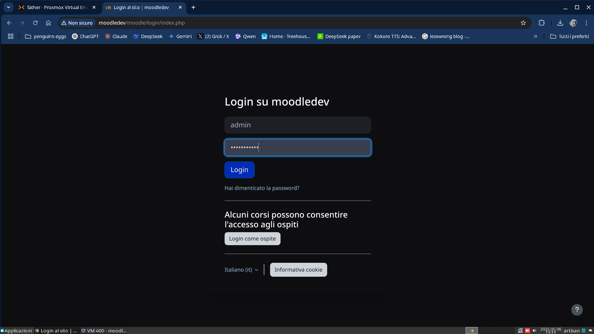

# README

moodledev è una semplice live Debian bookworm, adattata per lo sviluppo con moodle, la puoi trovare sul mio [googledrive](https://drive.google.com/drive/folders/18QIqicyecLMuU1Zmb2E039gWawzZuy3e?dmr=1&ec=wgc-drive-globalnav-goto) e scaricarla.

Avviata la live, potete utilizzarla così com'è, oppure installare il sistema utilizzando l'installer grafico calamares.

# User/password utilizzate

* L'utente mariadb è `root/evolution`
* L'utente di phpmyadmin è `phpmyadmin/evolution`
* L'utente per moodle è: `admin/Evolution@1`
* La cartella `moodle` è sotto `/var/www/html`
* La cartella `moodledata` è sotto `/var/www/moodledata`

# plugin modificati o in sviluppo

Sono inclusi, parzialmente funzionanti, i seguenti plugin:

* [moodle-local_boost_dark](https://github.com/pieroproietti/moodle-local_boost_dark)
* [moodle-local_welcome](https://github.com/pieroproietti/moodle-local_welcome)

# Utiizzo 
Potete utilizzare direttamente la live, avviatela ed impostate l'ip della rete su manuale. Nel mio  mio caso 192.`168.1.4/24 con gateway 192.168.1.254`,


Se sulla macchina host avete previsto in `/etc/hosts` una riga 
```
192.168.1.4    moodledev
```
Potete usarlo anche da questa, o da qualsiasi computer in rete che abbia impostato la risoluione per `moodledev`

## Login
Aprite il vostro browser all'indirizzo: `http://moodledev/` e cliccate sul link [moode]


Non vi resta che loggarmi con `admin/Evolution@1` e buona avventura!

# Guide
[Developer Resource centre](https://moodledev.io/)

 